# Ai Chatbot with Rate Limit

In this project I have build and integrate a rate limiter into an AI chatbot application to control usage costs and enforce fair access. 


## Objective 
Build a node.js application that implements `session-based` rate limiter using **Fixed Window**
### This project includes 
1. Fixed Window (1-hour) rate limiting
2.  User-based limits:
    - Guest → 3 requests/hour
    - Free → 10 requests/hour
    - Premium → 50 requests/hour

3.  Track by user ID (logged in) or IP address (guests)
4.  Integrate with Vercel AI SDK
5.  Validate rate limits before AI calls to save costs
6.  API endpoints (`/api/status`, `/api/chat`, `/api/auth/login`, `/api/auth/register`, `/api/auth/logout`)


## Why is rate limiting required?
Rate limiting is essential for creating robust and secure applications. The primary reasons for implementing it are:

- Prevents overload and ensures service reliability.
- Blocks brute-force attacks and malicious bots.
- Guarantees equitable resource access for all users.
- Manages API usage to prevent abuse and ensure fair use.

## JWT (JSON Web Token)
A JSON Web Token (JWT) is a secure and compact digital pass used to prove a user's identity and permissions. After a user logs in, the server creates a JWT containing their information (like user ID and access tier) and digitally signs it with a secret key. The user's application then sends this token in the header of every subsequent request to protected resources. The server can easily verify the token's signature to trust the data inside without needing to check a database every time, making it a highly scalable solution.

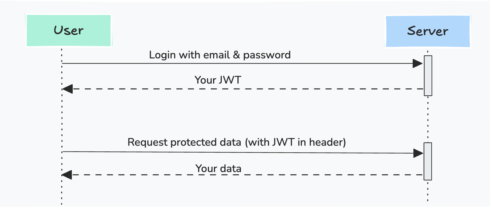

## Session-Based Rate Limiting
While IP-based rate limiting is useful, it treats everyone from a single location (like an office) the same. **Session-based limiting** is a more advanced technique that applies rules to an **authenticated user's session**, not just their IP address. This allows for flexible and fair policies, such as offering different usage tiers for different users.

- **Guest (by IP):** Limited to 3 image exports per hour.
- **Free User (by session):** Limited to 10 image exports per hour.
- **Pro User (by session):** Limited to 200 image exports per hour.
A guest user is quickly blocked after their 3rd export. However, when **Alex (a Free User)** logs in from the same network, the server identifies him by his unique session and grants him his own, separate limit of 10 exports. This tiered, session-based approach allows the platform to offer a better experience for logged-in users and premium features for paying customers.

### How It's Implemented: The Role of Session Tokens
This is typically implemented using **JSON Web Tokens (JWT).** When a user logs in, the server issues a secure JWT containing their `UserID` and `plan` (e.g., "Free"). The user's application then sends this token in the `Authorization` header of every subsequent request.


The server's rate-limiting middleware verifies this token. If a valid token is present, the middleware applies the rate limit corresponding to the user's tier and ID. If no token is found, it defaults to a stricter, guest-level limit based on the user's IP address.


## Project Overview
In this project, I will build a Node.js server using the **Express** framework that implements a session-based rate limiter. The server will have:

- A `/status` endpoint that use for check health of this application.
- A `/register` endpoint that use for register user to this application.
- A `/login` endpoint that simulates user authentication and issues a JWT.
- A protected `/chat` endpoint that uses our rate-limiting middleware.
- The middleware will distinguish between "Guest" (by IP), "Free" (by token), and "Pro" users (by token), applying a different rate limit to each.


Use **Postman** to test this entire flow, from logging in to get a token, to using that token to make rate-limited requests.

## Run Application
### Step 01: Configure Environment Variables
Create a `.env` file in your project root with the following variables:
```.env
OPENAI_API_KEY=
JWT_SECRET=
JWT_EXPIRES_IN=3600
APP_PORT=3000

DB_DATABASE=
DB_PASSWORD=
DB_USERNAME=
DB_HOST=localhost
DB_PORT=5432
```


### 02: Start Server
Execute the following commands to install dependencies, apply database migrations, and start the server:
```bash
cd project-directory
npm install
node star
```

## Code overview

1. `docker-compose.yml` for postgres database 
This file defines a PostgreSQL database service using Docker, providing a consistent and isolated environment for the application's data.

    ```yml
    services:
      postgres:
        image: postgres:15
        container_name: ai-chatboot-db
        environment:
          POSTGRES_DB: ${DB_DATABASE}
          POSTGRES_USER: ${DB_USERNAME}
          POSTGRES_PASSWORD: ${DB_PASSWORD}
        ports:
          - "5432:5432"
        volumes:
          - postgres_data:/var/lib/postgresql/data
        healthcheck:
          test: ["CMD-SHELL", "pg_isready -U postgres -d ${DB_PASSWORD}"]
          interval: 5s
          timeout: 5s
          retries: 5
        restart: unless-stopped

    volumes:
      postgres_data:
        driver: local

    ```

2. `server.js` Main Express Application

    This is the entry point of the application. It sets up the Express server, applies essential middleware like CORS and Morgan, connects to the database, and registers all API routes.

    ```javascript

    import express from 'express'
    import dotenv from 'dotenv'
    import cors from 'cors';
    import morgan from 'morgan';

    dotenv.config()

    import {runMigration} from './config/database.js'

    import healthHandler from './routes/health.js'
    import authHandler from './routes/auth.js'
    import chatbootHandler from './routes/chatboot.js'


    const app = express();
    app.use(express.json());
    app.use(cors());
    app.use(morgan('combined'));

    runMigration()

    app.use('/status', healthHandler);
    app.use('/chat', chatbootHandler)
    app.use('/auth', authHandler);


    app.use((req, res) => {
      res.status(404).send('Not Found');
    });

    const APP_PORT = process.env.APP_PORT || 3000

    app.listen(APP_PORT, () => {
      console.log(`Server running at http://localhost:${APP_PORT}`);
    });

    ```
3. `config/database.js` - Database Connection & Migration
This file manages the database connection pool using pg and handles the initial database migration to create the users table if it doesn't already exist.

    ```javascript 
    import dotenv from 'dotenv'
    import { Pool } from 'pg';

    dotenv.config()

    const connection = new Pool({
      host: process.env.DB_HOST,
      port: process.env.DB_PORT,
      database: process.env.DB_DATABASE,
      user: process.env.DB_USERNAME,
      password: process.env.DB_PASSWORD,
      max: 20,
      idleTimeoutMillis: 30000,
      connectionTimeoutMillis: 2000,
    });

    connection.on('connect', () => {
      console.log('Connected to PostgreSQL database');
    });

    connection.on('error', (err) => {
      console.error('Database connection error:', err);
    });


    const runMigration = ()=> {
      try {
        const query = `
          CREATE TABLE IF NOT EXISTS users (
              id UUID PRIMARY KEY DEFAULT gen_random_uuid(),
              email VARCHAR(255) UNIQUE NOT NULL,
              password VARCHAR(255) NOT NULL,
              plan VARCHAR(255) NOT NULL,
              created_at TIMESTAMP DEFAULT CURRENT_TIMESTAMP,
              updated_at TIMESTAMP DEFAULT CURRENT_TIMESTAMP
            );
        `

        connection.query(query)
        console.log("Database migration success!")
      } catch (error) {
          console.log("Database migration failed!")
      }
    }

    export default connection

    export {
      runMigration
    }

    ```

4. `middleware/auth.js` - Authentication Middleware
This middleware verifies the JWT sent with a request. It checks for a valid token, decodes it to get the user ID, and then verifies that the user exists in the database before allowing the request to proceed.


    ```javascript
    import jwt from 'jsonwebtoken'
    import dotenv from 'dotenv'
    import connection from '../config/database.js'

    dotenv.config()

    const authMiddleware = async (req, res, next) => {
      try {
        const token = req.header('Authorization')?.replace('Bearer ', '');
        
        if (!token) {
          return res.status(401).json({ error: 'Access denied. No token provided.' });
        }
        
        const decoded = jwt.verify(token, process.env.JWT_SECRET);
        
        const result = await connection.query(
          'SELECT id, email FROM users WHERE id = $1',
          [decoded.userId]
        );
        
        if (result.rows.length === 0) {
          return res.status(401).json({ error: 'Invalid token.' });
        }
        
        req.user = result.rows[0];
        next();
      } catch (error) {
        res.status(401).json({ error: 'Invalid token.' });
      }
    };

    export default authMiddleware

    ```
5. `middleware/rateLimiter.js` - Rate Limiting Middleware
This file contains the core rate-limiting logic. It uses a Fixed Window algorithm and a simple in-memory object (requestTracker) to count requests by user ID (from JWT) or IP address (for guests), applying different limits based on their assigned tier.


    ```javascript
    import jwt from 'jsonwebtoken'

    import dotenv from 'dotenv'
    dotenv.config()

    const rateLimitWindowMs = 1000 * 60  * 60; // 1 hour
    const userTiers = {
      guest: { limit: 3 },
      free: { limit: 10 },
      premium: { limit: 50 },
    };

    const requestTracker = {};
    const JWT_SECRET = process.env.JWT_SECRET


    const rateLimitMiddleware = (req, res, next) => {
      const authHeader = req.headers['authorization'];
      const token = authHeader && authHeader.split(' ')[1]; 
      const ip = req.socket.remoteAddress;
      const currentTime = Date.now();
      let userId;
      let userTier;


      if (token) {
        try {
          const decoded = jwt.verify(token, JWT_SECRET);
          
          userId = decoded.userId;
          userTier = userTiers[decoded.plan] || userTiers.guest;
        } catch (err) {
          userId = ip;
          userTier = userTiers.guest;
        }
      } else {
        userId = ip;
        userTier = userTiers.guest;
      }

      if (!requestTracker[userId]) {
        requestTracker[userId] = { count: 1, startTime: currentTime };
      } else {
        const windowData = requestTracker[userId];
        const timePassed = currentTime - windowData.startTime;
        if (timePassed < rateLimitWindowMs) {
          windowData.count++;
        } else {
          windowData.count = 1;
          windowData.startTime = currentTime;
        }
      }

      if (requestTracker[userId].count > userTier.limit) {
        return res.status(429).send(`Too many requests. Limit is ${userTier.limit} per minute.`);
      }

      next();
    };


    export default rateLimitMiddleware
    ```


6. `routes/health.js` - Health Check Route
A simple endpoint to check the health and status of the application.


    ```javascript
    import express from 'express'

    const router = express.Router();

    router.get('/', (req, res)=> {

      res.status(200).json({
        message: 'healthy',
        status: 200
      })
    })

    export default router;
    ```

7. `routes/auth.js` - Authentication Routes
This file handles user registration, login, and logout. It uses bcryptjs for secure password hashing and joi for request body validation.


    ```javascript

    import express from 'express'
    import bcrypt from 'bcryptjs'
    import Joi from 'joi';
    import jwt from 'jsonwebtoken'
    import dotenv from 'dotenv'
    import connection from '../config/database.js'
    import authMiddleware from './../middleware/auth.js'

    dotenv.config()

    const router = express.Router();
    const registerSchema = Joi.object({
      email: Joi.string().email().required(),
      password: Joi.string().required(),
      plan: Joi.string().valid('free', 'premium').required()
    })

    const loginSchema = Joi.object({
      email: Joi.string().email().required(),
      password: Joi.string().required()
    });


    router.post('/register', async (req, res, next) => {
      try {
        const { error, value } = registerSchema.validate(req.body);
        if (error) {
          return res.status(422).json({
            message: error.message,
            status: false
          })
        };
        
        const { email, password, plan } = value;
        
        const hashedPassword = await bcrypt.hash(password, 10);
        
        const result = await connection.query(
          'INSERT INTO users (email, password, plan) VALUES ($1, $2, $3) RETURNING id, email, created_at',
          [email, hashedPassword, plan]
        );
        
        const user = result.rows[0];
        
        res.status(201).json({
          message: 'User registered successfully',
          user: {
            id: user.id,
            email: user.email,
            createdAt: user.created_at
          }
        });
      } catch (error) {
        next(error);
      }
    });


    router.post('/login', async (req, res, next) => {
      try {
        const { error, value } = loginSchema.validate(req.body);

        if (error) {
          return res.status(422).json({
            message: error.message,
            status: false
          })
        };
        
        const { email, password } = value;
        
        const result = await connection.query(
          'SELECT id, email, plan, password FROM users WHERE email = $1',
          [email]
        );
        
        if (result.rows.length === 0) {
          return res.status(401).json({ error: 'Invalid credentials' });
        }
        
        const user = result.rows[0];
        
        const isValidPassword = await bcrypt.compare(password, user.password);
        if (!isValidPassword) {
          return res.status(401).json({ error: 'Invalid credentials' });
        }

        const token = jwt.sign({ userId: user.id, plan: user.plan, }, process.env.JWT_SECRET, { expiresIn: Number(process.env.JWT_EXPIRES_IN || 3600) });
        
        res.json({
          message: 'Login successful',
          token,
          user: {
            id: user.id,
            email: user.email,
            plan: user.plan
          }
        });
      } catch (error) {
        next(error);
      }
    });

    router.post('/logout', authMiddleware,  (req, res)=> {
      try {
        res.cookie("jwt", "", { maxAge: 0 });
        // Sending success response
        res.status(200).json({ message: "Logged out successfully", status: true });
      } catch (error) {
        res.status(500).json({ error: "Internal Server Error" });
      }
    })


    export default router;
    ```

8. `routes/chatbot.js` - AI Chatbot Integration
This file defines the primary API endpoint for interacting with the AI chatbot. It is a critical component of the application, as it integrates the AI service while being protected by the rate-limiting middleware to manage costs and prevent abuse.


    ```javascript
    // routes/users.js
    import express from 'express'
    import rateLimitMiddleware from '../middleware/rateLimitter.js';

    import { streamText } from 'ai';
    import { openai } from '@ai-sdk/openai';

    const router = express.Router();

    router.post('/', rateLimitMiddleware,  async (req, res)=> {
      try {
        const { messages } = req.body;

        // Validate the request body
        if (!messages || !Array.isArray(messages)) {
          return res.status(400).json({ error: 'Messages array is required.' });
        }

        // Use streamText to get a streaming response
        const result = await streamText({
          model: openai('gpt-4o-mini'),
          messages: messages,
        });

        res.setHeader('Content-Type', 'text/plain');
        res.setHeader('Cache-Control', 'no-cache');
        res.setHeader('Connection', 'keep-alive');
        res.setHeader('X-Content-Type-Options', 'nosniff'); // Security header

        for await (const textPart of result.textStream) {
          res.write(textPart);
        }

        res.end();

      } catch (error) {
        console.error('Server-side error:', error);
        if (!res.headersSent) {
          res.status(500).send('An internal server error occurred.');
        } else {
          console.error('An error occurred after the response started streaming.');
        }
      }
    })


    export default router;
    ```


## Step 03: Test with Postman
We will now use the Postman application to test our server's tiered rate limits.

#### 1. Test the "Guest" Limit (by IP)
  - Open Postman and create a new request.
  - Set the method to **GET** and the URL to `{{API_URL}}/chat`.
  - Make sure no Authorization header is set.
  - Click **Send**. The first request will succeed.
  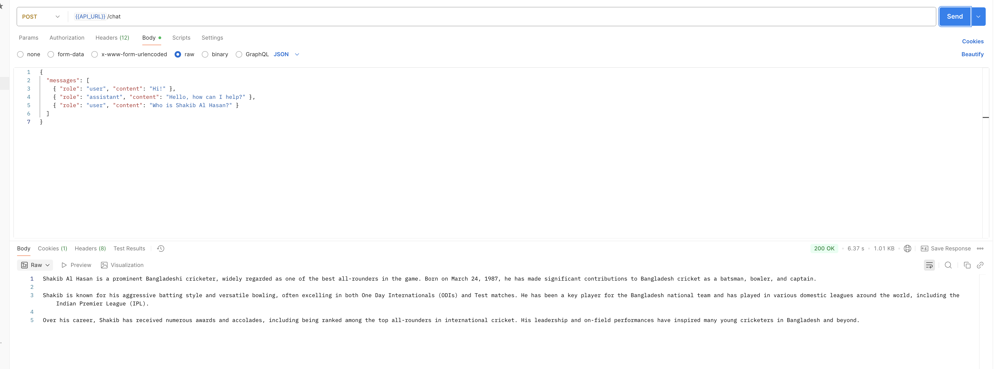
  - Click **Send** repeatedly. You will see that the first 3 requests succeed.
  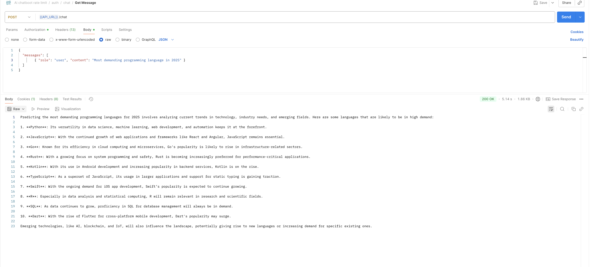

  - Click **Send** a second time. You will receive a **429 Too many requests error**, because the guest limit is 3.
  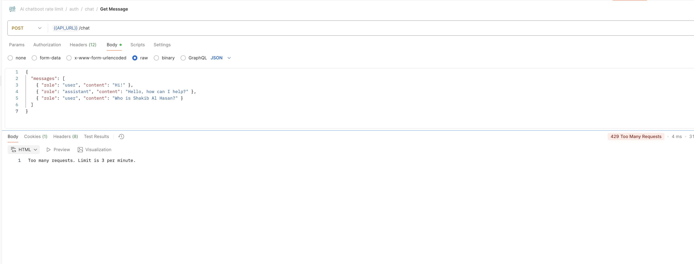

#### 2. Register user 
  -  Create another new request.
  - Set the method to **POST** and the URL to ``{{API_URL}}/register``.
  - Go to the **Body** tab and select ***raw*** & **json**.
  - Add two keys: `email` with the value your email, `plan` with value `free` or `premium` and `password` with the value your password.
  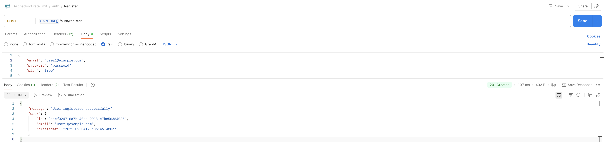


#### 3. Get a JWT for the User
  -  Create another new request.
  - Set the method to **POST** and the URL to ``{{API_URL}}/login``.
  - Go to the **Body** tab and select ***raw*** & **json**.
  - Add two keys: `email` with the value your email and `password` with the value your password.
  

  - Click **Send**. You will get a JSON response containing a long `token` string. Copy this token.
  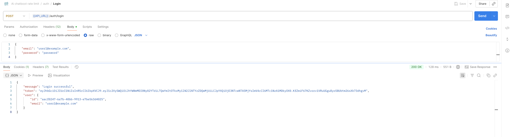

  - Set `jwt` token 
  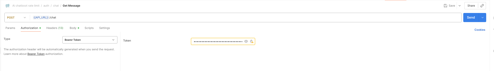

  

#### 4. Test the "Free" User Limit
  - Go back to your `GET /chat` request.
  - Go to the **Authorization** tab.
  - Set the **Type** to **Bearer Token**.
  - In the **Token** field on the right, paste the JWT you copied.
  - Click **Send** repeatedly. You will see that the first 10 requests succeed.
  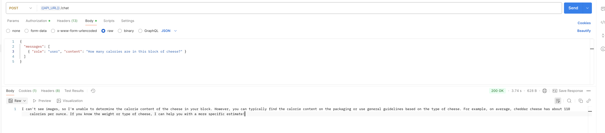
  - Click **Send** again. You will receive a 4**29 Too many requests error**, confirming the "Premium" tier limit is working.
  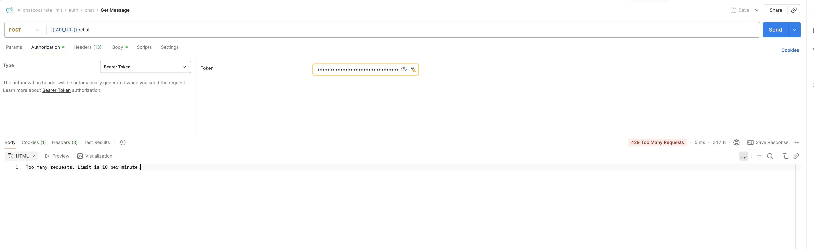

  #### 3. Test the "Premium" User Limit
  - Go back to your `GET /chat` request.
  - Go to the **Authorization** tab.
  - Set the **Type** to **Bearer Token**.
  - In the **Token** field on the right, paste the JWT you copied.
  - Click **Send** repeatedly. You will see that the first 50 requests succeed.
  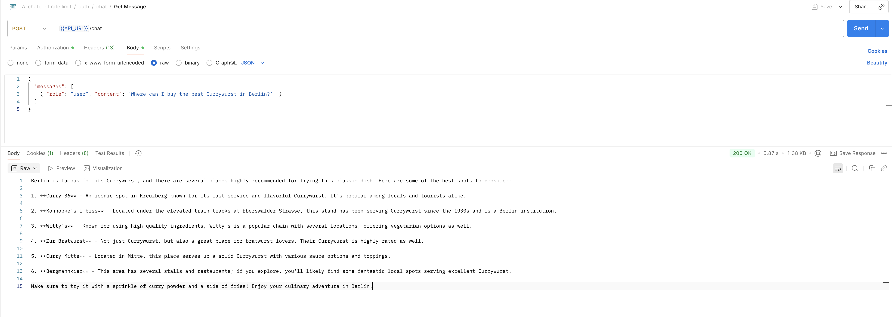
  - Click **Send** again. You will receive a 4**29 Too many requests error**, confirming the "Premium" tier limit is working.
  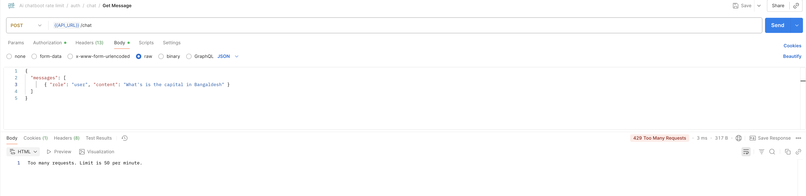
You can repeat steps 2 and 3 for the `premium` to test their higher limit of 50 requests per minute.

